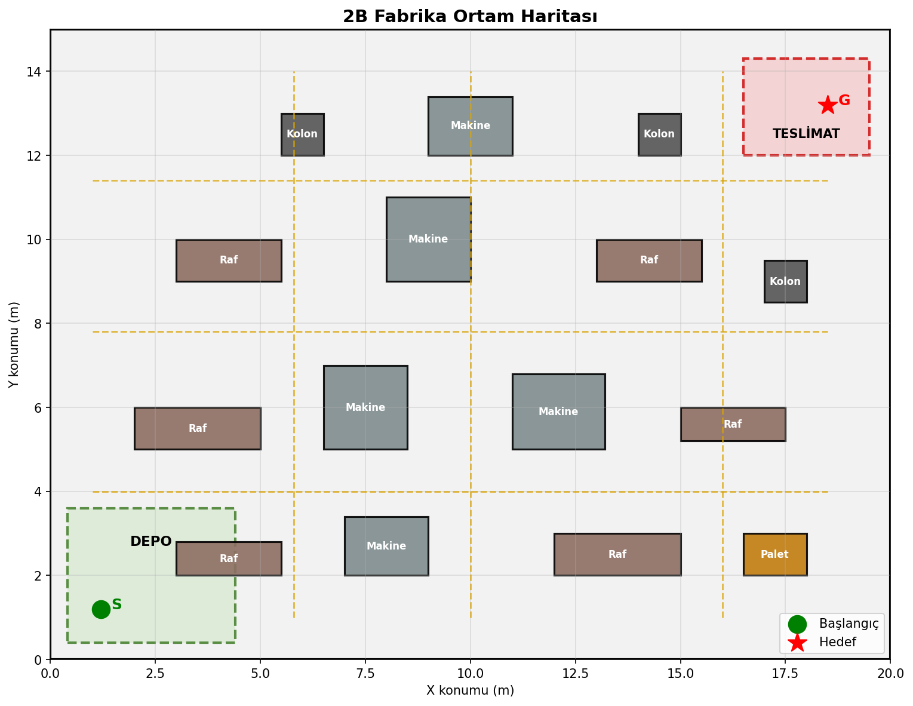
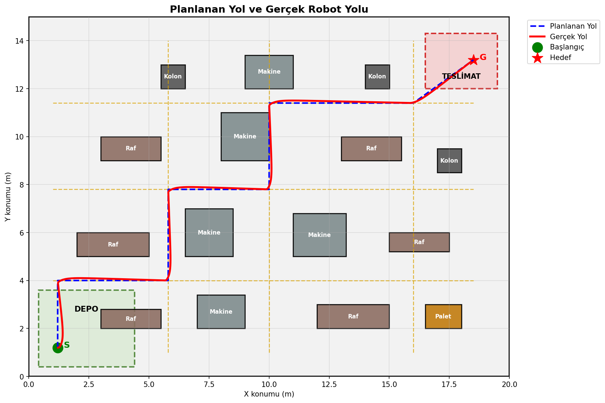
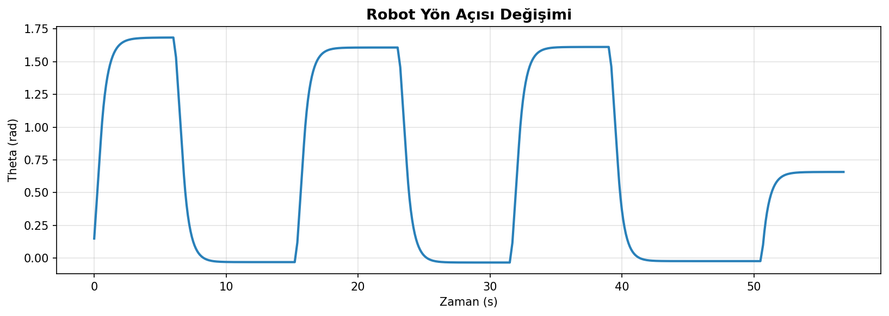
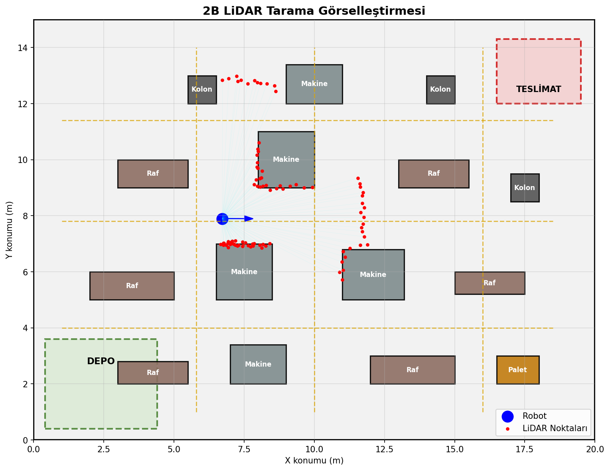
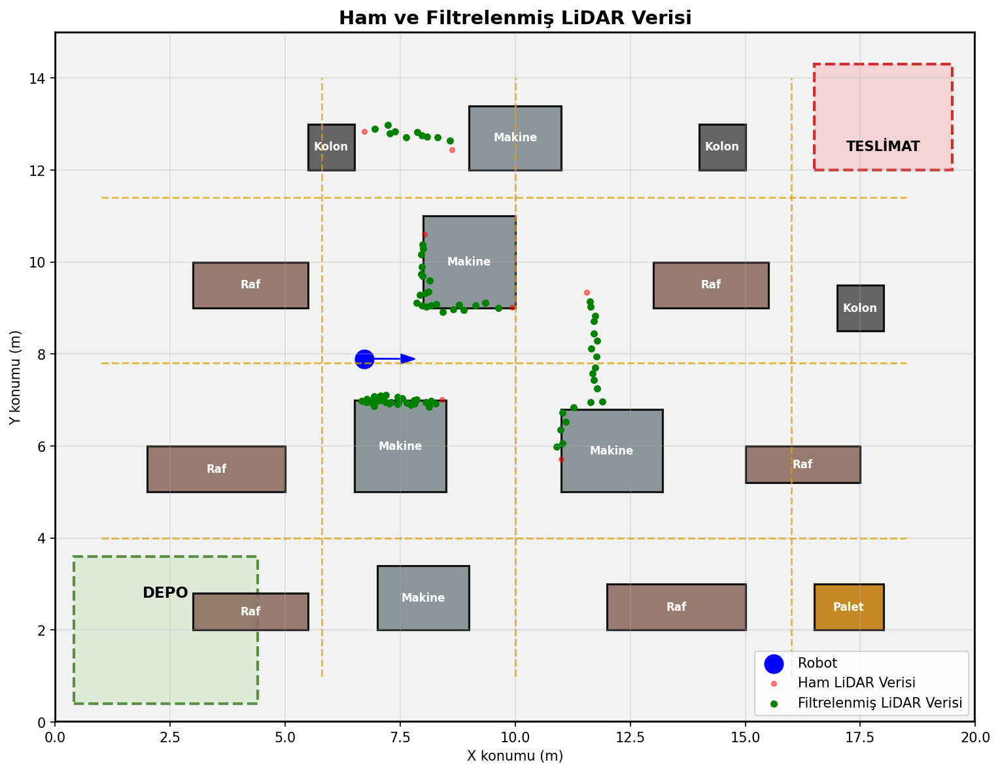
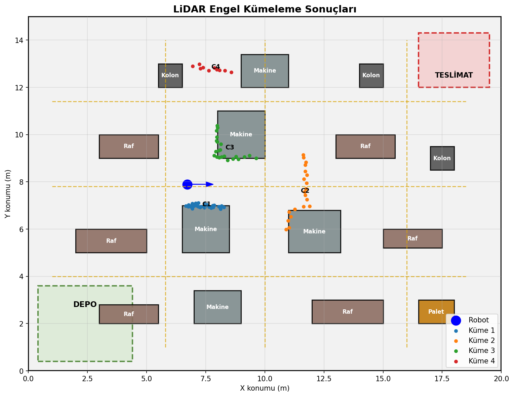
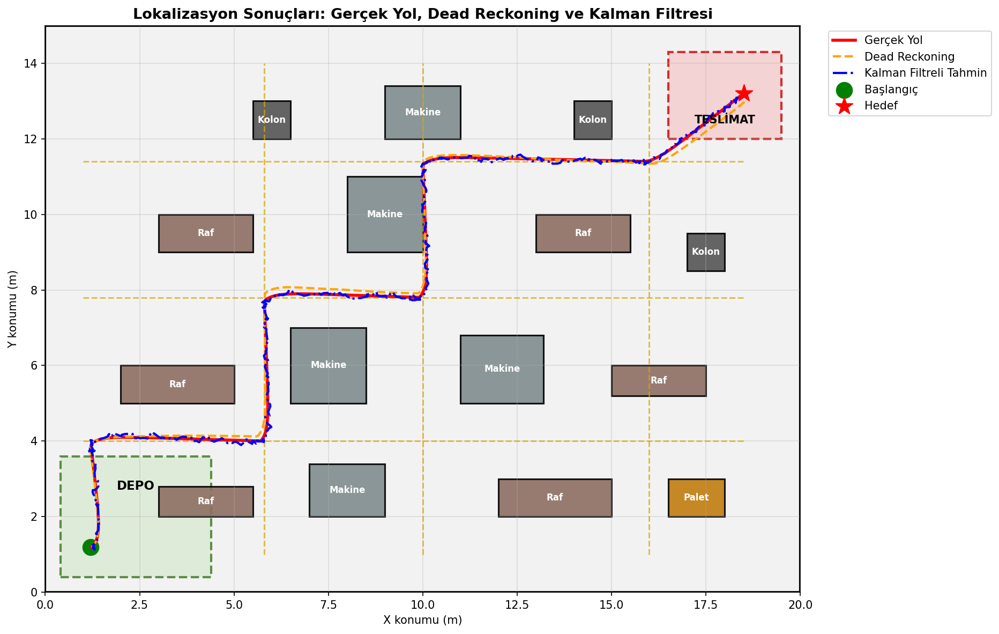
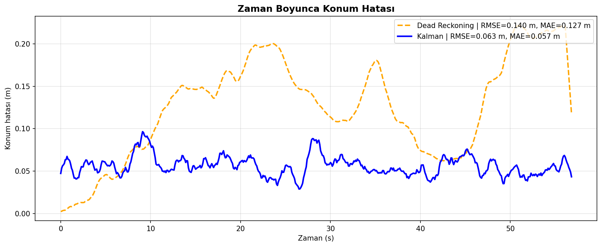

# Mobil Robot Navigasyon Simülasyonu

Bu proje, fabrika benzeri bir iç ortamda hareket eden otonom mobil robot için geliştirilen 2B navigasyon simülasyonunu içermektedir.

Simülasyon Python dili kullanılarak geliştirilmiş olup mobil robotlarda kullanılan temel navigasyon ve lokalizasyon yaklaşımlarını göstermeyi amaçlamaktadır.

---

# Proje İçeriği

Projede aşağıdaki bileşenler bulunmaktadır:

- Waypoint tabanlı yol planlaması
- Non-holonomik robot hareket modeli
- 2B LiDAR simülasyonu
- LiDAR filtreleme
- Engel kümeleme
- Dead Reckoning lokalizasyonu
- Kalman Filtresi ile sensör füzyonu
- Hata analizi ve grafiksel sonuçlar

---

# Senaryo

Senaryoda otonom bir mobil robot, akıllı fabrika ortamında depo bölgesinden aldığı parçaları teslimat alanına taşımaktadır.

Robot hareket ederken:

- Raflar
- Makineler
- Kolonlar
- Paletler

gibi statik engeller arasında güvenli şekilde ilerlemektedir.

Robotun çevre algısı LiDAR sensörü ile sağlanmış, konum tahmini ise Dead Reckoning ve Kalman Filtresi yöntemleri kullanılarak gerçekleştirilmiştir.

---

# Kullanılan Teknolojiler

- Python
- NumPy
- Matplotlib

Projede ek bir robotik framework kullanılmamıştır.

---

# Üretilen Çıktılar

Simülasyon sonunda aşağıdaki görseller oluşturulmaktadır:

- 2B fabrika ortam haritası
- Planlanan ve gerçek robot yolu
- Robot yön açısı değişimi
- LiDAR tarama görselleştirmesi
- Ham ve filtrelenmiş LiDAR verisi
- Engel kümeleme sonuçları
- Lokalizasyon karşılaştırması
- Konum hata analizi grafiği

---

# Dosyalar

| Dosya | Açıklama |
|---|---|
| main.py | Ana simülasyon kodu |
| Mobil_Robot_Rapor.pdf | Proje raporu |
| Figure_*.png | Simülasyon çıktıları |
# Simülasyon Çıktıları

## 1. 2B Fabrika Ortam Haritası

## 2. Planlanan ve Gerçek Robot Yolu

## 3. Robot Yön Açısı Değişimi

## 4. LiDAR Tarama Görselleştirmesi

## 5. Ham ve Filtrelenmiş LiDAR Verisi

## 6. LiDAR Engel Kümeleme Sonuçları

## 7. Lokalizasyon Sonuçları

## 8. Zaman Boyunca Konum Hatası

---

# Lokalizasyon Sonuçları

| Yöntem | RMSE (m) | MAE (m) |
|---|---|---|
| Ölü Hesap | 0.140 | 0.127 |
| Kalman Filtresi | 0.063 | 0.057 |

Kalman filtresi, ölü hesap yöntemine göre konum hatasını belirgin şekilde azaltmıştır.

---

# Yapay Zekâ Kullanım Beyanı

Bu proje sürecinde ChatGPT Plus (GPT-5.5) ve Claude araçlarından destek alınmıştır.

Yapay zekâ araçları:

- hata ayıklama,
- kod geliştirme,
- teknik açıklamaların düzenlenmesi,
- ve rapor yazımı süreçlerinde yardımcı araç olarak kullanılmıştır.

Simülasyonun tasarımı, test edilmesi, sonuçların yorumlanması ve nihai düzenlemeler tarafımdan gerçekleştirilmiştir.

---

# Hazırlayan

Beyza İpek  
21406601020
Bursa Teknik Üniversitesi  
MKTS0323 - Mobil Robotlar
